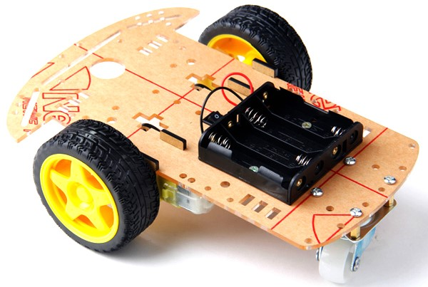
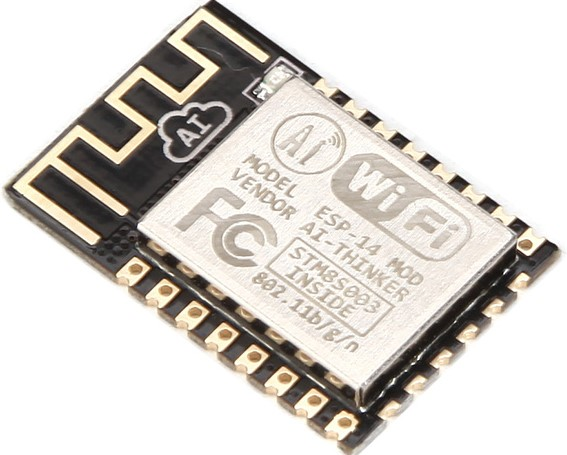
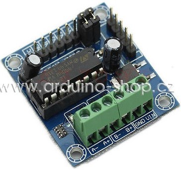
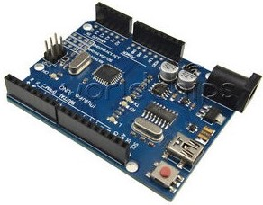
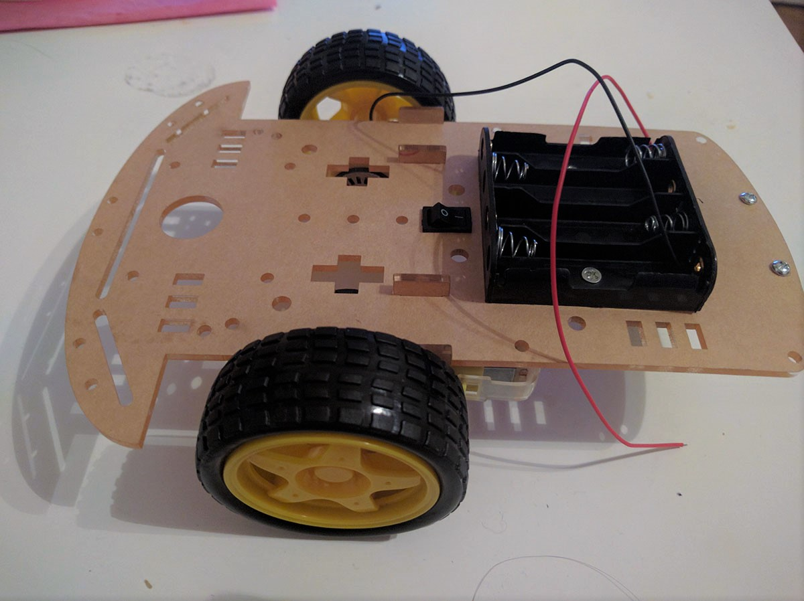
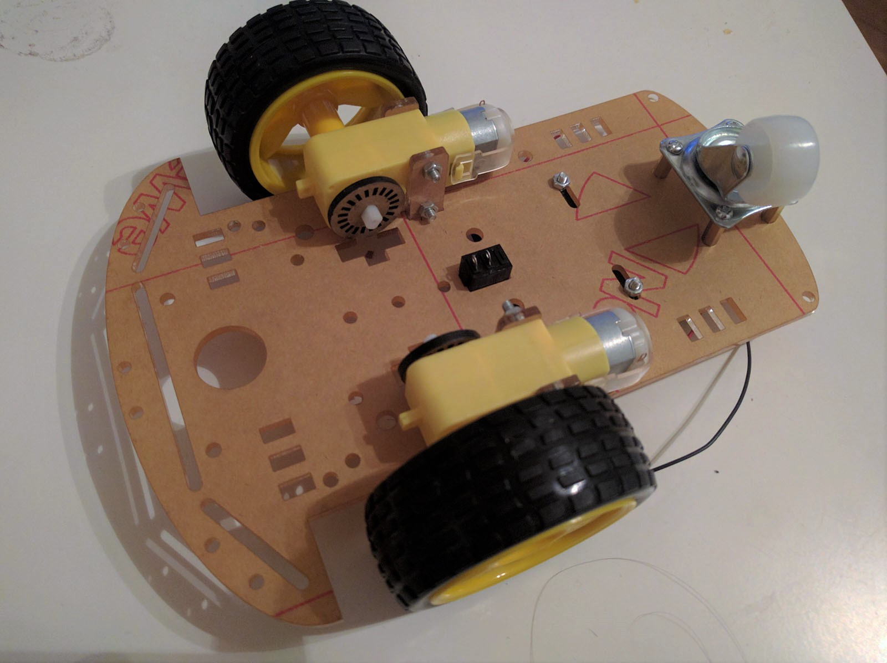
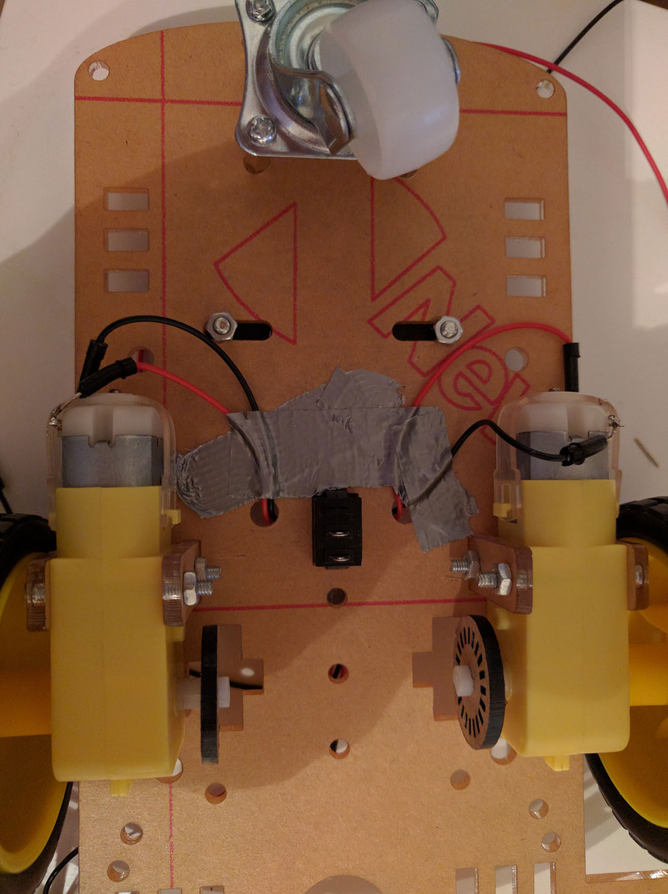
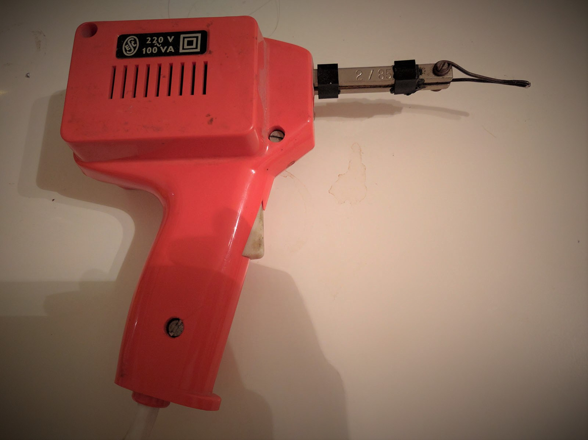
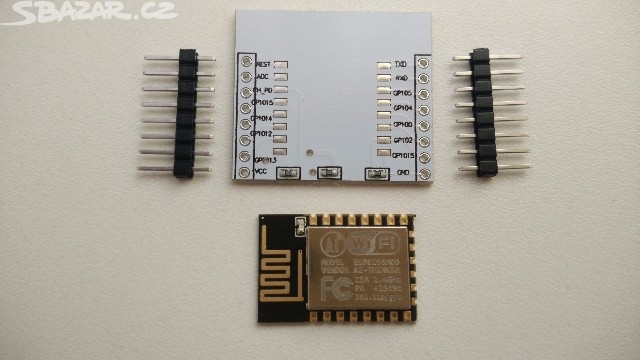

#Arduino Robot

Tento dokument popisuje postup a procesy pro výrobu dálkově řízeného, motory poháněného robota pomocí Arduino a Node.js. Bezdrátový přenost bude realizován skrz WiFi, pohyb robota bude řízen otáčením dvou motorů podle příkazů vysílaných z webového prohlížeče.
Většinu součástí můžete koupit samostatně, tak jako jsem to udělal já, lépe ale uděláte, pokud koupíte již hotové sety. např. [tenhle nadupaný set za necelých 20$](https://www.aliexpress.com/item/New-Avoidance-tracking-Motor-Smart-Robot-Car-Chassis-Kit-Speed-Encoder-Battery-Box-2WD-Ultrasonic-module/32362408263.html). Díly koupíte i na českých eshopech za celkem rozumné ceny, o poznání levněji je pak nakoupíte například na eshopech ebay nebo aliexpress. Pokud ovšem vydržíte čekat 3 týdny na doručení? :-)
## Součásti

|         | část           | cena  | popis |
| ------------- |:-------------:|:-----:| --------:|
|       |  [podvozek 2WD](http://robotstore.cz/obchod/arduino/2wd-podvozek-pro-inteligentni-auto-arduino-robot-2/), [zde](https://www.aliexpress.com/item-img/For-Arduino-Motor-Smart-Robot-Car-Chassis-Kit-Speed-Encoder-Battery-Box-2WD/32621177415.html?spm=2114.10010108.1000017.2.deRVVP) | 589 | 2 x motor v převodovém poměru 1:48 / DC 3-6V,  215mm x 153mm |
|       |  [esp8266](http://robotstore.cz/obchod/arduino/esp8266-wi-fi-modul-arduino-esp-14/?added-to-cart=13641)  | 129 | Wifi modul včetně entény |
|  |  [drive l293d](http://robotstore.cz/obchod/arduino/esp8266-wi-fi-modul-arduino-esp-14/?added-to-cart=13641) | 133 | řízení motorů Vstupní. napětí DC4.5-25V 
|  |  [Arduino uno](http://arduino-shop.cz/arduino/1353-klon-arduino-uno-r3-atmega328p-ch340-mini-usb-1466635561.html) |  194 |  mikrokontrolérová vývojová deska

### Podvozek

Podvozek 2WD Arduiono Robot se skládá ze dvou motorů 3-6V. Na baterie je přiložen zásobník pro 4 kusy 1.5V baterií typu AA(dohromady 6V). Existuje spoustu druhů, které jsou zdánlivě hodně podobné, ale liší se v kvalitě materiálu a výroby. Návod na sestavení je součástí balení (v čínštině), avšak dá se to postavit i bez něj. Pokud si chcete být jistý, že máte například správně otočený motory atp. doporučuji tutorial na např. [youtube](https://www.youtube.com/watch?v=VHuOJ54YXaA). Motory nemají připájeny dráty na zapojení, přijde tedy i čas na to, vyhrabat z půdy starou pájkou a trochu cínu, dráty připájet a zajistit.

| Top | Bottom | Wires | Solder |
|--- | --- | --- | ---|
|  |  |  | 

### Propojení Arduina s motory

K ovládání robota budeme potřebovat dva motory. K podvozku 2WD jsme dostali dva s [převodovým poměrem](http://mlgeardesigns.blog.cz/1311/prevodovy-pomer) 1:48 / DC 3-6V (DC - direct current = stejnosměrný proud). Protože motory prochází větší proud, než kolik je možné dodávat samotné Arduino (do 20mA), budeme potřebovat controller (řadič) na který motory napojíme. Ten nám umožní připojit externí zdroj napájení a navíc snadno ovládat motory, konkrétně rychlost (0-255) a směr(0 a 1). Řadič je tzv [H-můstek](https://en.wikipedia.org/wiki/H_bridge), konkrétní, který použijeme obsahuje obvod [L293D](http://www.ti.com/lit/ds/symlink/l293d.pdf) ([další info zde](http://www.hobbyrobot.cz/wp-content/uploads/bridge05.pdf)). Podle specifikacích můžeme použít společně s externím napájením v rozmezí 4.5V - 36V s maximálním proudem 0.6A. Protože podle [některých zdrojů](http://zschlebnice.sk/kopr/arduino_hbridge.php) má můstek sám o sobě úbytek 1.5V, takže je možné, že budeme potřebovat přidat ještě jednu AA baterii pro dosažení maximálního výkonu motorů.

Po zapojení budeme řešit dva problémy:
1. ovládat otáčení motoru přímo z Arduino, návod [zde](http://nul.cz/arduino/arduino-rizeni-krokoveho-motoru/) nebo [zde](http://zschlebnice.sk/kopr/arduino_hbridge.php)
2. ovládat otáčení motoru přes WiFi
https://www.youtube.com/watch?v=jhism2iqT7o

- 
http://zschlebnice.sk/kopr/arduino_hbridge.php

### Propojení Arduino s WiFI
K Arduino jsem si pořídil modul ESP8266 s adapterem.

Kdo by nevěděl tak jako já, jak takový adapter použít, stačí když se podívá na následující video, kde je všechno jasné, viz [Youtube](https://www.youtube.com/watch?v=O2SSyfP6OM0). Opět tedy potřebujeme pájku. Tentokrát by se víc hodila mikro pájka, já si ale budu muset vystačit s tím co mám. 

- http://wifinodebot.blogspot.cz/2016/02/blink-led-over-wifi-with-nodejs-johnny.html

