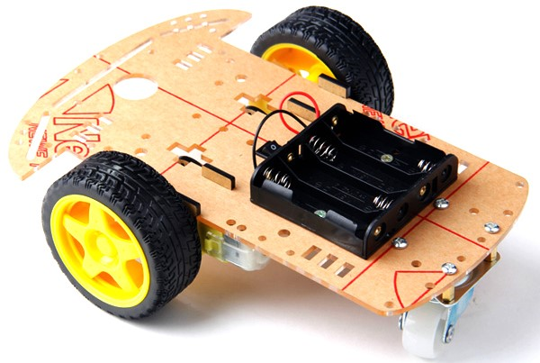
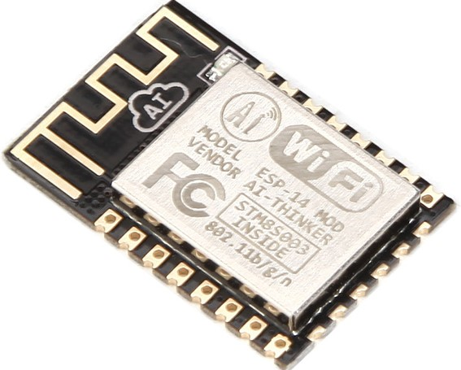
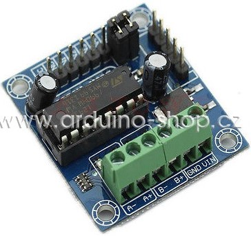
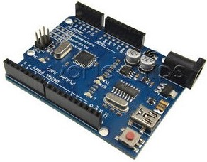

#Arduino Robot

Cílem projektu je vytvořit dálkově řízeného robota pomocí WiFi a Node.js. Pro snažší programování budeme používat knihovnu http://johnny-five.io/ Robot by měl reagovat otáčením motoru podle příkazů vysílaných z webového prohlížeče.

## Inspirace

- https://learn.adafruit.com/wifi-controlled-mobile-robot/connections

## Součástí

|  | položka | Kč | popis
|--|--|--|--|
|  | [podvozek](http://robotstore.cz/obchod/arduino/2wd-podvozek-pro-inteligentni-auto-arduino-robot-2/) | 589 | 2 x motor v převodovém poměru 1:48 / DC 3-6V,  215mm x 153mm
|  | [esp8266](http://robotstore.cz/obchod/arduino/esp8266-wi-fi-modul-arduino-esp-14/?added-to-cart=13641) | 129 | Wifi modul včetně entény
|  | [drive l293d](http://robotstore.cz/obchod/arduino/esp8266-wi-fi-modul-arduino-esp-14/?added-to-cart=13641) | 133 | řízení motorů Vstupní. napětí DC4.5-25V 
|  | [Arduino uno](http://arduino-shop.cz/arduino/1353-klon-arduino-uno-r3-atmega328p-ch340-mini-usb-1466635561.html) | 194 |  mikrokontrolérová vývojová deska

### Podvozek

Podvozek 2WD Arduiono Robot se skládá ze dvou motorů 3-6V, napájeny jsou externě, 4 tužkové baterie 1.5V (Celkem 6V). Existuje spoustu druhů, které jsou zdánlivě hodně podobné, ale liší se v kvalitě materiálu a výroby. Návod na sestavení např. [zde](https://www.youtube.com/watch?v=VHuOJ54YXaA)

### Propojení Arduina s motory
- http://nul.cz/arduino/arduino-rizeni-krokoveho-motoru/
http://zschlebnice.sk/kopr/arduino_hbridge.php

### Propojení Arduino s WiFI s pomocí johny five
- http://wifinodebot.blogspot.cz/2016/02/blink-led-over-wifi-with-nodejs-johnny.html
