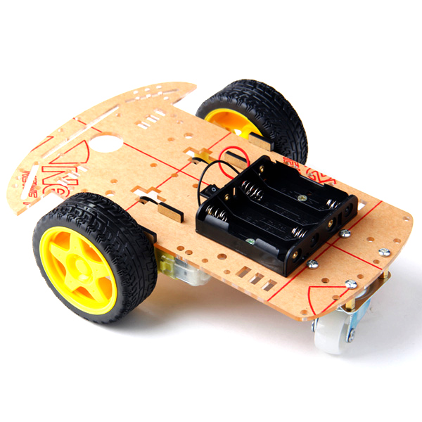
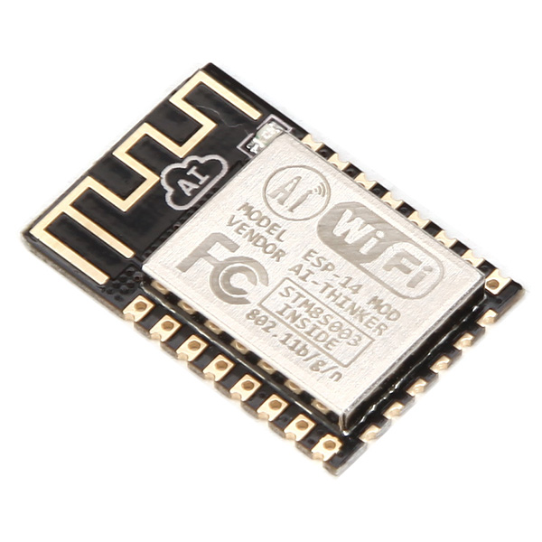
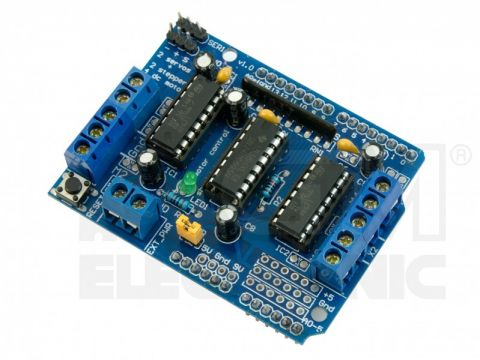

#Arduino Robot

## Inspirace

- https://learn.adafruit.com/wifi-controlled-mobile-robot/connections
- http://wifinodebot.blogspot.cz/2016/02/blink-led-over-wifi-with-nodejs-johnny.html
- http://nul.cz/arduino/arduino-rizeni-krokoveho-motoru/

## Součástí

http://robotstore.cz/obchod/arduino/2wd-podvozek-pro-inteligentni-auto-arduino-robot-2/

http://robotstore.cz/obchod/arduino/esp8266-wi-fi-modul-arduino-esp-14/?added-to-cart=13641

https://www.gme.cz/arduino-motor-shield-l293d

### Propojení Arduina s motory
http://zschlebnice.sk/kopr/arduino_hbridge.php
