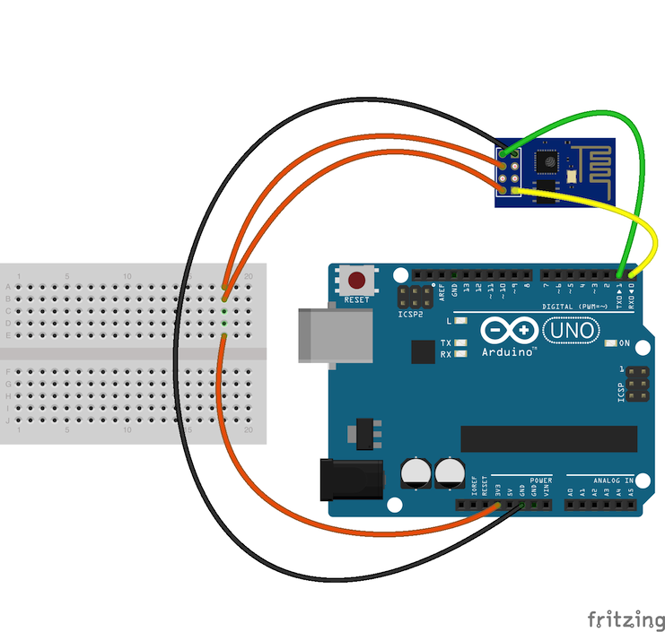

# WiFI Arduino

http://wifinodebot.blogspot.cz/2016/02/blink-led-over-wifi-with-nodejs-johnny.html

https://www.youtube.com/watch?v=z07zjfOHb8E

http://allaboutee.com/2015/01/02/esp8266-arduino-led-control-from-webpage/

http://fab.cba.mit.edu/classes/865.15/people/dan.chen/esp8266/

https://room-15.github.io/blog/2015/03/26/esp8266-at-command-reference/

http://www.instructables.com/id/Using-the-ESP8266-module/step5/Communicating-with-the-module/

http://www.instructables.com/id/Using-the-ESP8266-module/step6/Running-a-simple-webserver-in-BASIC/

http://www.espressif.com/sites/default/files/4a-esp8266_at_instruction_set_en_v1.5.4_0.pdf

https://www.itead.cc/wiki/ESP8266_Serial_WIFI_Module

http://allaboutee.com/2015/01/20/esp8266-android-application-for-arduino-pin-control/

http://allaboutee.com/2014/12/27/esp8266-arduino-code-and-circuit/

https://github.com/esp8266/Arduino#minimal-hardware-setup-for-bootloading-and-usage

https://github.com/esp8266/Arduino/issues/770

https://forum.arduino.cc/index.php?topic=283043.0

http://allaboutee.com/2014/12/30/esp8266-and-arduino-webserver/

https://learn.sparkfun.com/tutorials/esp8266-thing-hookup-guide/installing-the-esp8266-arduino-addon

https://www.arduino.cc/en/Reference/Firmata

http://www.instructables.com/id/ESP8266-Firmata-J5-NodeBot/?ALLSTEPS

http://www.pridopia.co.uk/pi-doc/ESP8266ATCommandsSet.pdf

http://forum.arduino.cc/index.php?topic=195603.0

Skript který dokáže ovládat diodu pomocí WiFi

 

 

